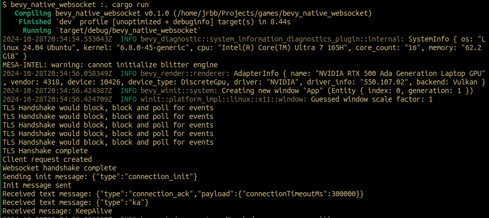

# Websockets in Bevy

Done in short notice to provide some examples of how to use websockets in Bevy.

This is an excerpt of a Native Websocket example that can be used to connect to any tls (wss) websocket endpoint.

## Testing with AppSync

Create an AppSync endpoint and create a .env file based on the .env.example file and input the AppSync endpoint.

```bash
cargo run
```

Correctly configured AppSync API and auth method should connect to the endpoint and send an init message and get back a connection ack and keep alive messages.



## Authorization

I am using a custom lambda in my project, see [https://docs.aws.amazon.com/appsync/latest/devguide/security-authz.html](https://docs.aws.amazon.com/appsync/latest/devguide/security-authz.html) for more information.
